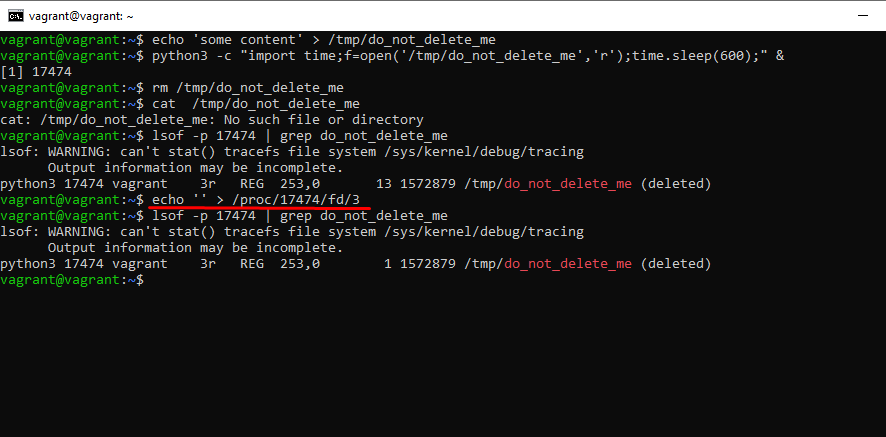

# Домашнее задание к занятию "3.3. Операционные системы, лекция 1"

1. Установленный vagrant и ubuntu - скриншот в файле

   > Какой системный вызов делает команда cd?
   
   Ответ: Команда cd делает 2 системных вызова 1 - stat - получение статуса файла (m+c) 
   2 - chdir - изменяет рабочую директорию (m+c)

   

2. Попробуйте использовать команду file на объекты разных типов на файловой системе. Например:
vagrant@netology1:~$ file /dev/tty

   > Используя strace выясните, где находится база данных file на основании которой она делает свои догадки.
   
    

3. Предположим, приложение пишет лог в текстовый файл. Этот файл оказался удален (deleted в lsof), однако возможности сигналом сказать приложению переоткрыть файлы или просто перезапустить приложение – нет. 
Так как приложение продолжает писать в удаленный файл, место на диске постепенно заканчивается. 

   > Основываясь на знаниях о перенаправлении потоков предложите способ обнуления открытого удаленного файла (чтобы освободить место на файловой системе).
   
   

4. Занимают ли зомби-процессы какие-то ресурсы в ОС (CPU, RAM, IO)?

    Ответ: Зомби не занимают памяти (как процессы-сироты), но блокируют записи в таблице процессов, размер которой ограничен для каждого пользователя и системы в целом.

5. В iovisor BCC есть утилита opensnoop:
  
   > root@vagrant:~# dpkg -L bpfcc-tools | grep sbin/opensnoop
   > /usr/sbin/opensnoop-bpfcc
   
   

6. Какой системный вызов использует uname -a?
  
   

   > Приведите цитату из man по этому системному вызову, где описывается альтернативное местоположение в /proc, где можно узнать версию ядра и релиз ОС.
   
   Ответ:  Part of the utsname information is also accessible  via  /proc/sys/kernel/{ostype, hostname, osrelease, version, domainname}.

7. Чем отличается последовательность команд через ; и через && в bash? Например:

   >root@netology1:~# test -d /tmp/some_dir; echo Hi
   >Hi
   >root@netology1:~# test -d /tmp/some_dir && echo Hi
   >root@netology1:~#
   
   Ответ:
   && - условный оператор
   ;  - разделитель последовательных команд

   test -d /tmp/some_dir && echo Hi - в данном случае echo отработает только при успешном завершении команды test
   set -e - прерывает сессию при любом ненулевом значении исполняемых команд в конвейере кроме последней.
   в случае &&  вместе с set -e- вероятно не имеет смысла, так как при ошибке, выполнение команд прекратиться. 

8. Из каких опций состоит режим bash set -euxo pipefail и почему его хорошо было бы использовать в сценариях? 

   Ответ: -e прерывает выполнение исполнения при ошибке любой команды кроме последней в последовательности 
    -x вывод трейса простых команд 
    -u неустановленные/не заданные параметры и переменные считаются как ошибки, с выводом в stderr текста ошибки и выполнит завершение не интерактивного вызова
    -o pipefail возвращает код возврата набора/последовательности команд, ненулевой при последней команды или 0 для успешного выполнения команд.

    По сути, для сценария, повышает детализацию вывода ошибок(логирования), 
    и завершит сценарий при наличии ошибок, на любом этапе выполнения сценария, кроме последней завершающей команды
    
9. Используя -o stat для ps, определите, какой наиболее часто встречающийся статус у процессов в системе. В man ps ознакомьтесь (/PROCESS STATE CODES) что значат дополнительные к основной заглавной буквы статуса процессов. Его можно не учитывать при расчете (считать S, Ss или Ssl равнозначными).

   Ответ: S 
   На втором месте идут процессы R+
    
   