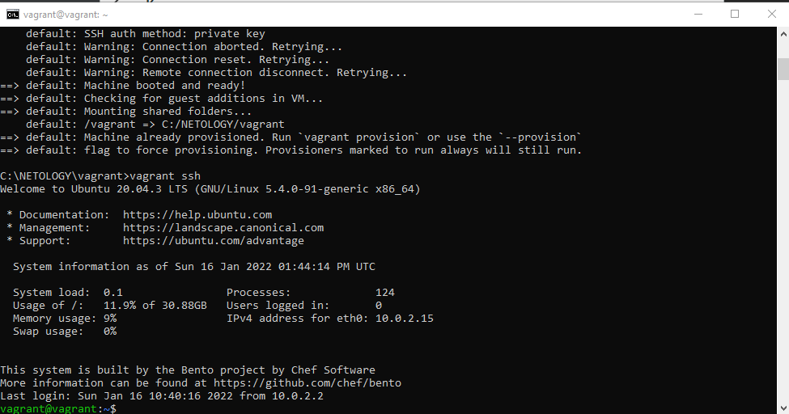
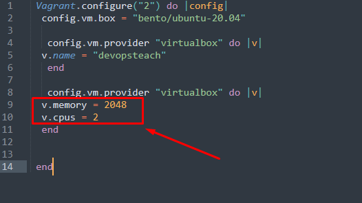
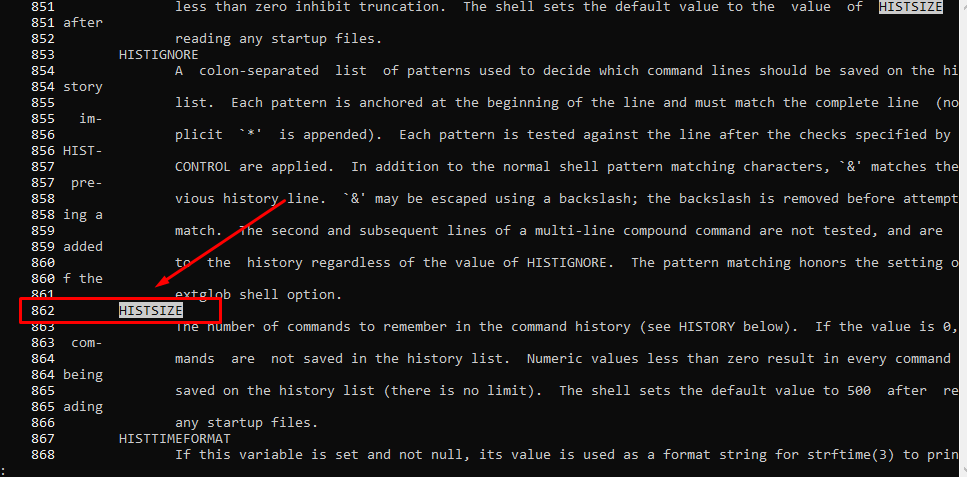
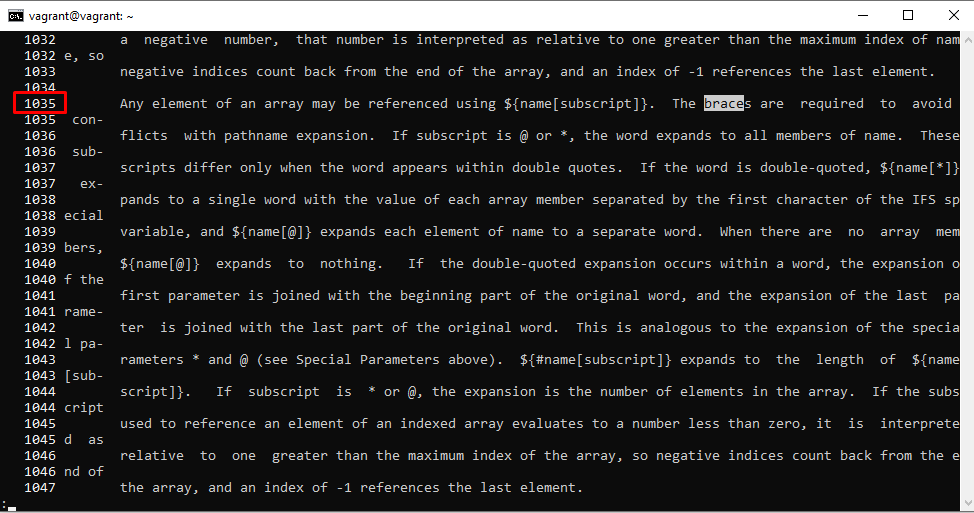
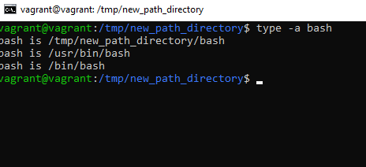
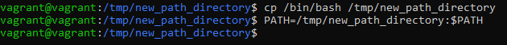

# Домашнее задание к занятию "3.1. Работа в терминале, лекция 1"

1. Установленный vagrant и ubuntu - скриншот в файле

   > Установите средство виртуализации Oracle VirtualBox.

   > Установите средство автоматизации Hashicorp Vagrant.
   
   

2. Пункт 6

   > Как добавить оперативной памяти или ресурсов процессора виртуальной машине?
   
    

3. Пункт 8

   > какой переменной можно задать длину журнала history, и на какой строчке manual это описывается?
   
    Ответ: HISTSIZE

   

   > что делает директива ignoreboth в bash?

       Ответ: не сохранять в истории строки начинающиеся с символа <пробел> и  не сохранять строки, совпадающие с последней выполненной командой

4. Пункт 9

   > В каких сценариях использования применимы скобки {} и на какой строчке man bash это описано?

    
    Ответ: {} зарезервированные слова, список, в т.ч. список команд команд в отличии от "(...)" исполнятся в текущем инстансе, 
    используется в различных условных циклах, условных операторах, или ограничивает тело функции, 
    В командах выполняет подстановку элементов из списка , если упрощенно то  цикличное выполнение команд с подстановкой 
    например mkdir ./DIR_{A..Z} - создаст каталоги сименами DIR_A, DIR_B и т.д. до DIR_Z

5. Пункт 10
  
   > С учётом ответа на предыдущий вопрос, как создать однократным вызовом touch 100000 файлов? Получится ли аналогичным образом создать 300000? Если нет, то почему?
   
   Ответ: touch {000001..100000}  
   300000 - нет, это слишком длинный список аргументов 

6. Пункт 11 
  
   > В man bash поищите по /\[\[. Что делает конструкция \[\[ -d /tmp \]\]
   

   Ответ: проверяет условие у -d /tmp и возвращает ее статус (0 или 1), наличие катаолга /tmp

7. Пункт 12
   > Основываясь на знаниях о просмотре текущих (например, PATH) и установке новых переменных; командах, которые мы рассматривали, добейтесь в выводе type -a bash в виртуальной машине наличия первым пунктом в списке:

   
   
8. Пункт 13 

   > Чем отличается планирование команд с помощью batch и at?
   
   Ответ: batch - запускается когда позволяет нагрузка (ниже 1.5), at - запускается по заданному времени