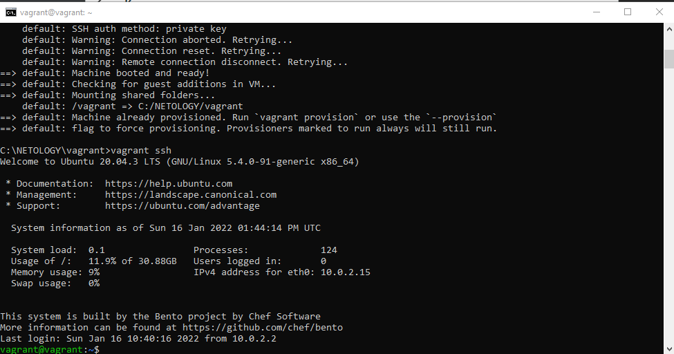

# Домашнее задание к занятию "3.1. Работа в терминале, лекция 1"

1. Установленный vagrant и ubuntu - скриншот в файле 
2. Пункт 8
> какой переменной можно задать длину журнала history, и на какой строчке manual это описывается?
   
Ответ: HISTSIZE

>что делает директива ignoreboth в bash?

Ответ: не сохранять строки начинающиеся с символа <пробел> и  не сохранять строки, совпадающие с последней выполненной командой

