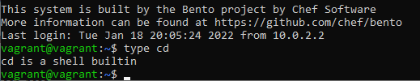
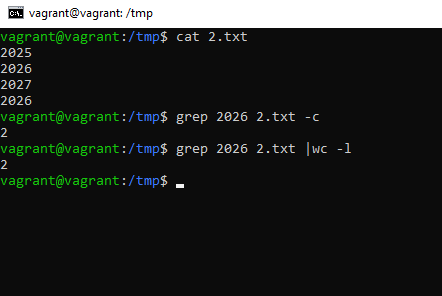
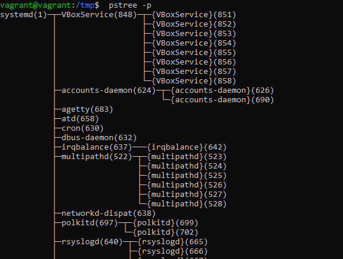
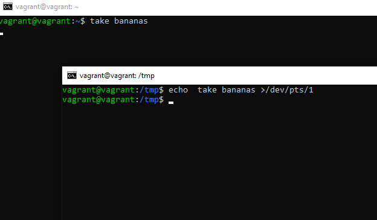
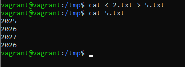
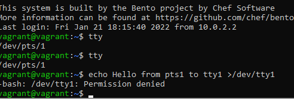
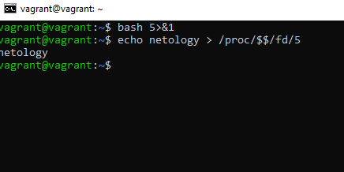
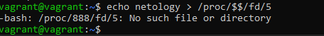
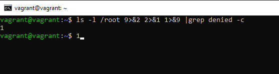
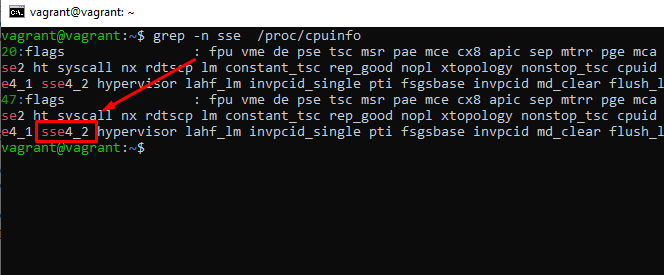

# Домашнее задание к занятию "3.2. Работа в терминале, лекция 2"

1. Пункт 1

   > Какого типа команда cd? Попробуйте объяснить, почему она именно такого типа; опишите ход своих мыслей, если считаете что она могла бы быть другого типа.
   
   Ответ встроенная. Встроенная, потому что, работать внутри сессии терминала логичнее менять указатель на текущую директорию внутренней функцией, 
   Если использовать внешний вызов, то он будет работать со своим окружением, и менять текущий каталог внутри своего окружения, а на shell из которого он вызван влиять не будет.
    
   
2. Пункт 2

   > Какая альтернатива без pipe команде grep <some_string> <some_file> | wc -l? man grep поможет в ответе на этот вопрос.
   
    

3. Пункт 3

   > Какой процесс с PID 1 является родителем для всех процессов в вашей виртуальной машине Ubuntu 20.04?
   
   

4. Пункт 4

   > Как будет выглядеть команда, которая перенаправит вывод stderr ls на другую сессию терминала?

    

5. Пункт 5
  
   > Получится ли одновременно передать команде файл на stdin и вывести ее stdout в другой файл? Приведите работающий пример.
   
   

6. Пункт 6
  
   > Получится ли находясь в графическом режиме, вывести данные из PTY в какой-либо из эмуляторов TTY? Сможете ли вы наблюдать выводимые данные?
   

   Ответ: Нет. Пишет недостаточно прав.
   

7. Пункт 7

   > Выполните команду bash 5>&1. К чему она приведет? Что будет, если вы выполните echo netology > /proc/$$/fd/5? Почему так происходит?

   
   

   Ответ: bash 5>&1 - Создаст дескриптор с 5 и перенаправит его в stdout
    echo netology > /proc/$$/fd/5 - выведет в дескриптор "5", который был перенаправлен в stdout
    если запустить echo netology > /proc/$$/fd/5 в новой сессии, получим ошибку, так как такого дескриптора нет на данный момент в текущей(новой) сессии

8. Пункт 8 

   > Получится ли в качестве входного потока для pipe использовать только stderr команды, не потеряв при этом отображение stdout на pty? Напоминаем: по умолчанию через pipe передается только stdout команды слева от | на stdin команды справа. Это можно сделать, поменяв стандартные потоки местами через промежуточный новый дескриптор, который вы научились создавать в предыдущем вопросе.
   
   

   Ответ: 9>&2 - новый дескриптор перенаправили в stderr
   2>&1 - stderr перенаправили в stdout 
   1>&9 - stdout - перенаправили в новый дескриптор

9. Пункт 9 

  > Что выведет команда cat /proc/$$/environ? Как еще можно получить аналогичный по содержанию вывод?
  
   Ответ: Будут выведены переменные окружения: можно получить тоже самое (только с разделением по переменным по строкам): 
    printenv
    env
   
10. Пункт 10

    > Используя man, опишите что доступно по адресам /proc/<PID>/cmdline, /proc/<PID>/exe.
    
    Ответ: /proc/<PID>/cmdline - полный путь до исполняемого файла процесса [PID]  (строка 231)
     /proc/<PID>/exe - содержит ссылку до файла запущенного для процесса [PID], 
                        cat выведет содержимое запущенного файла, 
                        запуск этого файла,  запустит еще одну копию самого файла  (строка 285) 

11. Пункт 11

    > Узнайте, какую наиболее старшую версию набора инструкций SSE поддерживает ваш процессор с помощью /proc/cpuinfo.
    
    
    

12. Пункт 12

   > При открытии нового окна терминала и vagrant ssh создается новая сессия и выделяется pty. Это можно подтвердить командой tty, которая упоминалась в лекции 3.2. Однако:

   > vagrant@netology1:~$ ssh localhost 'tty'
   > not a tty
   > Почитайте, почему так происходит, и как изменить поведение.
    
   Ответ: Единственное что смог найти: то, что при подключении ожидается пользователь, а не другой процесс, и нет локального tty в данный момент. 
    для запуска можно добавить -t - , и команда исполняется c принудительным созданием псевдотерминала

   vagrant@vagrant:~$ ssh -t localhost 'tty'
   vagrant@localhost's password: 
   /dev/pts/2
   Connection to localhost closed.
   vagrant@vagrant:~$ 

13. Пункт 13

    > Бывает, что есть необходимость переместить запущенный процесс из одной сессии в другую. Попробуйте сделать это, воспользовавшись reptyr. Например, так можно перенести в screen процесс, который вы запустили по ошибке в обычной SSH-сессии.
    
    Ответ:
    При первых запусках ругался на права, 10-patrace.conf
    после установки значения  kernel.yama.ptrace_scope = 0
    после чего процесс был перехвачен в screen, и продолжил работу после закрытия терминала. 
    единственное в pstree процесс не отображался, точнее отражался в виде процесса reptyr. не сразу сообразил что это то, что нужно 

14. Пункт 14
   
    > sudo echo string > /root/new_file не даст выполнить перенаправление под обычным пользователем, так как перенаправлением занимается процесс shell'а, который запущен без sudo под вашим пользователем. Для решения данной проблемы можно использовать конструкцию echo string | sudo tee /root/new_file. Узнайте что делает команда tee и почему в отличие от sudo echo команда с sudo tee будет работать.
    
    Ответ: 
    команда tee делает вывод одновременно и в файл, указаный в качестве параметра, и в stdout, 
    в данном примере команда получает вывод из stdin, перенаправленный через pipe от stdout команды echo
    и так как команда запущена от sudo , соответственно имеет права на запись в файл
    
